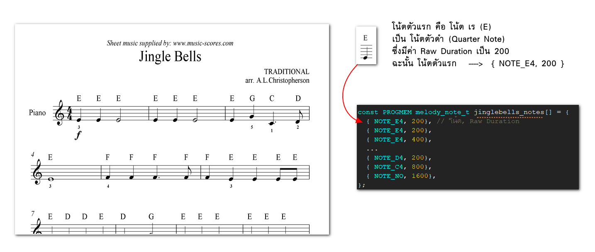

# BlynkGO_Buzzer
 ESP32 Buzzer with beep and melody  by non-blocking  
### คุณสมบัติ
- buzzer สามารถ beep ตามจำนวนครั้งที่กำหนดได้
- buzzer สามารถ beep ต่อเนื่อง และสั่งหยุดได้
- buzzer สามารถ เล่น โน้ตดนตรี ทำ melody ได้
- และที่สำคัญที่สุดคือ ระหว่าง buzzer กำลัง เล่นเสียง  
อุปกรณ์รอบข้างอื่นๆ ก็ยังทำงานต่อไปได้   
จอยังแสดงผลอื่นๆได้ สัมผัสยังสัมผัสได้   
โดยไม่ต้องหยุดรอ buzzer เล่นจนจบ   
ซึ่งจะเป็นข้อดี เมื่ออุปกรณ์ รอบข้าง   
เพิ่มจำนวนขึ้น จะได้ไม่ต้องสะดุดหยุดรอกัน   
  
## Buzzer Wiring

<p align="left">
  
</p>  
<p align="left">
  
</p>  


## Buzzer Beep

```cpp
#include <BlynkGO_Buzzer.h>

Buzzer buzzer(23);              // กำหนดขา pin

void setup(){
  Serial.begin(115200); Serial.println();
  
  buzzer.beep(3);    // beep 3 times

  // buzzer.beep();  // beep non stop
  // buzzer.stop();  // stop beeping
}

void loop(){
  
}
```

## Buzzer Melody

```cpp

#include <BlynkGO_Buzzer.h>

MELODY_DECLARE(melody_jingle_bells);

Buzzer buzzer(23);              // กำหนดขา pin ของ buzzer

void setup() {
  Serial.begin(115200); Serial.println();

  buzzer.addMelody(melody_jingle_bells);

  buzzer.playMelody();         // play แบบ วนไปเรื่อยๆ
  
  // buzzer.playMelody(1);     // หากจะ play แบบรอบเดียว

  // หากจะ play แบบ 2 รอบ และ เมื่อเล่นเสร็จให้ทำอะไรต่อ
  // buzzer.playMelody(2, [](){
  //   /* เมื่อเล่นจบให้ทำอะไรวางตรงนี้ */
  //   Serial.println("[Melody] Done");
  // });

  // buzzer.pauseMelody();     // หากจะ pause หยุดชั่วคราว
  // buzzer.playMelody();      // หากจะ กลับมาเล่นต่อจากที่เคย pause ไว้
  // buzzer.stopMelody();      // หากจะ stop ยกเลิกการ play เลย

}

void loop(){

}
```

## Melody Note (โน้ตสำหรับทำ melody)

<p align="left">
  
</p>  
  
  
```cpp
NOTE_NO   // Rest Note (เงียบเสียง)
NOTE_B0 
NOTE_C1   
NOTE_CS1   
NOTE_D1   // โด
NOTE_DS1  // โด #
NOTE_E1   // เร
NOTE_F1   // มี
NOTE_FS1  // มี #
NOTE_G1   // ฟา
NOTE_GS1  // ฟา #
NOTE_A1   // ซอล
NOTE_AS1  // ซอล #
NOTE_B1   // ลา
NOTE_C2   // ที
NOTE_CS2  // ที #
NOTE_D2
NOTE_DS2 
NOTE_E2
NOTE_F2
NOTE_FS2 
NOTE_G2
NOTE_GS2 
NOTE_A2
NOTE_AS2 
NOTE_B2
NOTE_C3
NOTE_CS3 
NOTE_D3
NOTE_DS3 
NOTE_E3
NOTE_F3
NOTE_FS3 
NOTE_G3
NOTE_GS3 
NOTE_A3
NOTE_AS3 
NOTE_B3
NOTE_C4
NOTE_CS4 
NOTE_D4
NOTE_DS4 
NOTE_E4
NOTE_F4
NOTE_FS4 
NOTE_G4
NOTE_GS4 
NOTE_A4
NOTE_AS4 
NOTE_B4
NOTE_C5
NOTE_CS5 
NOTE_D5
NOTE_DS5 
NOTE_E5
NOTE_F5
NOTE_FS5 
NOTE_G5
NOTE_GS5 
NOTE_A5
NOTE_AS5 
NOTE_B5
NOTE_C6
NOTE_CS6 
NOTE_D6
NOTE_DS6 
NOTE_E6
NOTE_F6
NOTE_FS6 
NOTE_G6
NOTE_GS6 
NOTE_A6
NOTE_AS6 
NOTE_B6
NOTE_C7
NOTE_CS7 
NOTE_D7
NOTE_DS7 
NOTE_E7
NOTE_F7
NOTE_FS7 
NOTE_G7
NOTE_GS7 
NOTE_A7
NOTE_AS7 
NOTE_B7
NOTE_C8
NOTE_CS8 
NOTE_D8
NOTE_DS8 
```

## Melody Raw Duration
<p align="left">
  
</p>
  
## Melody BPM (Beat Per Minute)
BPM ค่า จังหวะดนตรีของ melody  
โดยเมื่อเป็นโน้ตตัวดำ (Quarter Note) จะมีกี่ Beat (ครั้ง) ต่อนาที  
  
- BPM มีค่ามาก โน้ตแต่ละตัว ใน melody จะมีจังหวะที่สั้นลง เพลงจะเล่นเร็วขึ้น  
- BPM มีค่าน้อย โน้ตแต่ละตัว ใน melody จะมีจังหวะที่ยาวขึ้น เพลงจะเล่นยืดเวลานานขึ้น  

**ตัวอย่าง** BPM=60 แสดงว่า melody นี้  
หากเป็นโน้ตตัวดำ (Quarter Note) จะมีจังหวะทั้งสิ้น 60 ครั้งต่อนาที  
โดย โน้ตตัวดำ จะ ใช้เวลาเล่นจริง (True Duration) = 60000/60 = 1000 มิลลิวินาที  
  
ค่า BPM สามารถดูจากที่โน้ตเพลง (Sheet Music) นั้นๆ ได้ดังนี้   
  
<p align="left">
  
</p>
  
.  
## True Duration Equation (สมการค่า Duration จริง)

สมการค่า Duration จริง คำนวนตามสูตร  
  
}&space;&space;[ms])  
.  
### ตัวอย่าง
หากโน้ตเพลง มี BPM สำหรับ โน้ตตัวดำ 135 ครั้งต่อนาที  
  
และ ในโน้ตเพลง มี โน้ต F (ฟา) เปฺ็นโน้ตตัวดำ (Quarter Note) อยู่  
แต่ โน้ตตัวดำ มี Raw Duration = 200  
ฉะนั้น โน้ต F (ฟา) ที่เป็นโน้ตตัวดำ จะใช้เวลาในการเล่นจริง 444 มิลลิวินาที  
  
}=&space;&space;444&space;ms)  
.  
และ หากในโน้ตเพลง มีโน้ต D (โด) เป็นโน้ตตัวขาว (Half Note) อยู่  
แต่ โน้ตตัวขาว มี Raw Duration = 400  
ฉะนั้น โน้ต D (โด) ที่เป็นโน้ตตัวขาว จะใช้เวลาในการเล่นจริง 888 มิลลิวินาที  
  
}=&space;&space;888&space;ms)  
.  
## การสร้าง Melody File จากโน้ตเพลง

Melody File เป็น ไฟล์ นามสกุล .c  
ประกอบด้วย 3 ส่วนหลักๆ คือ  
  
**1. Include Part**  
**2. NOTE Part**  
**3. Melody Description Part**  
  
<p align="left">
  
</p>  
  
### 1 Inclue Part
```c
#include "melody_struct.h"
```
  
### 2 NOTE Part
ส่วนข้อมูล ของ ตัวโน้ตทั้งหมด ของ melody นึงๆ 
โดยสามารถแปลงจาก Sheet Music (โน้ตเพลง) ได้  
ตามตัวอย่าง ดังนี้  
  
<p align="left">
  
</p>  
  
<ins>**หมายเหตุ**</ins> ให้จัดเก็บข้อมูล ไว้บน PROGMEM  
  
### 3 Melody Description Part
- notes : คือ pointer ที่ชี้ไปยังตารางโน้ตเพลง ที่ NOTE Part
- size  : จำนวนโน้ตทั้งหมดใน melody
- bpm   : ค่า Beat ต่อ นาที ของ melody ของโน้ตตัวดำ (Quarter Note's BPM)

## Melody File Usage  
**วิธีใช้ Melody File บนโปรเจค ArduionIDE**   
  
1. ให้นำ melody c file ที่ตระเตรียม  
มาวางในโฟลเดอร์ โปรเจคที่สร้างบน ArduinoIDE  
  
  
2. ก่อนใช้่งาน ให้ประกาศ ด้วย  
  
```c
MELODY_DECLARE(melody_jingle_bells);
```
  
&nbsp;&nbsp;&nbsp;&nbsp;โดย วางไว้ก่อน `void setup()`  

3. ให้ buzzer เรียกใช้งานด้วยคำสั่ง

```c
buzzer.addMelody(melody_jingle_bells);
buzzer.playMelody();   // คำสั่งเล่น Melody จากเริ่มต้น, หากเคย pause หยุดชั่วคราว จะกลับมาเล่น ต่อจากเดิม
buzzer.pauseMelody();  // คำสั่งหยุด Melody ชั่วคราว
buzzer.stopMelody();   // คำสั่งหยุดเล่น Melody ถาวร หากกลับมาเล่นด้วย playMelody() จะเริ่มเล่นตั้งแต่ต้น
```


## About 

### Version 1.0
BlynkGO  
22/03/22
